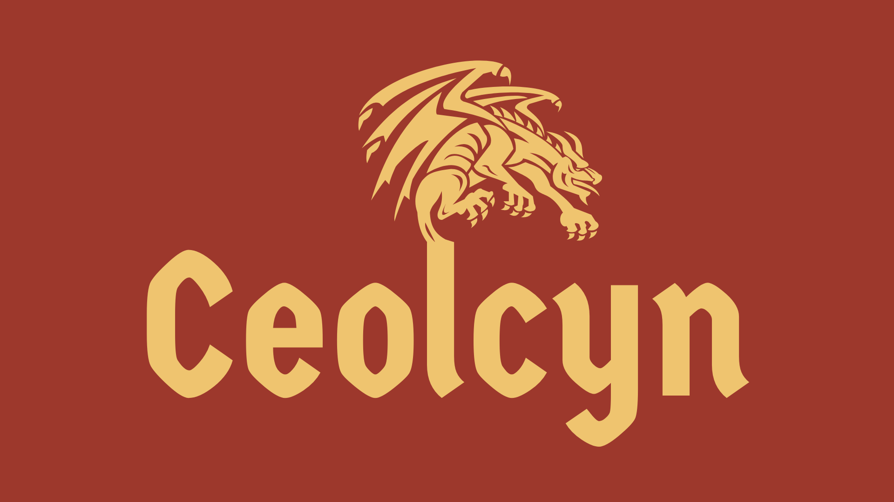

## Ceolcyn




Jeu donjon et rpg solo ou multi, adapté de nouvelle de Ceolcyn

### L'équipe

- Lucas GAIO DOS SANTOS : Chef de projet, développeur SQL et Python
- Esther LEMBEMOKO : Membre du projet, développeur Python
- Nicolas BARBARISI : Membre du projet, développeur Python

#### Nom de l'équipe

Le nom de l'équipe est un jeu de mot avec le réalisateur **Tim Burton**.

#### Attibution des rôles

- Développement des classes : Esther
- Mise en place de la base de donnée : Lucas
- Mise en place du multijoueur : Nicolas
- Développement de l'interface graphique : Toute l'équipe
- Rédaction du cahier des charges : Nicolas et Esther

### Technologies utilisées

#### Développement du jeu

Le jeu est développé en Python sous forme de commande en ligne.

#### Base de donnée

La base de donnée est développée avec MySQL.

#### Multijoueur

La partie multijoueur à été développée en Python avec des *sockets*.

### Scénario 

Sur le continent de Ceolcyn, à l'Est se trouve des tribus, alors province de l'empire d'Oresea. C'est sur les terre de Tourcia, proche de la frontière occidentale de ce pays que se retrouve les principaux conflits. Les clercs de Gatlanean ont rassemblé des paladins pour retrouver le tombeau d'un roi, appartenant à un lointain passer, où les guivres volaient toujours au dessus des plaines et étaient le fléau de l'humanité. 
            
L'Empire d'Oresea ne pouvait rester sans agir, l'empereur détacha alors ses meilleurs druides, berserks et autres guerriers pour la même mission que ce pays religieux qu'est Gatlanean. 
            
L'ennemis héréditaire de l'empire n'étant autre que la confédération de Preshoke, le duché de Launsia, situé à la frontière nord, étant son vassale, ils suivirent le mouvement, non pas en aidant Gatlanean, risquant de devoir leur offrir tout les trésors du tombeau, non, montant leur propre expédition, de chevalier et religieux.
            
Ce fut alors comme cela que commença l'une des plus belles balades encore conté par les bardes. Où les trois plus grande puissances ce sont livré à une course autour d'un mythe. Sûrement une des course les plus épiques qu'a connu notre continent.

### Visuels

### Installation

Vous devez tout d'abord télécharger le projet :
- Soit directement sur le site en cliquant sur le bouton de téléchargement (Zip ou Tar.gz) ;
- Soit en utilisant Git : `git clone git@github.com:Voldlov/Team-Burton.git` .

### Utilisation

Vous devez executer le main.py pour pouvoir lancer le jeu :

```cmd
> & C:/Python39/python.exe C:/yourdirectory/Team-Burton/main.py
```

#### Gameplay

#### Multijoueur

Le multijoueur ne fonctionne qu'en local pour le moment.

Avant de lancer une partie en multijoueur, il faut déjà allumer le serveur. Pour cela, executez le script `Serveur.py` soit sur votre machine soit sur une autre machine qui fera office de serveur:
```cmd
> & C:/Python39/python.exe C:/yourdirectory/Team-Burton/multijoueur/Serveur.py
```

Une fois executé, le serveur se lance :
```bash
Serveur prêt (port 50026 ) en attente de clients...
```

Sur cette même machine ou une autre machine en local, executez le script `Client.py` :
```cmd
> & C:/Python39/python.exe C:/yourdirectory/Team-Burton/multijoueur/Client.py
Adresse IP du serveur ? 127.0.0.1 // ou localhost
Numéro du port ? 50026 // vous pouvez laisser vide par défaut
Vous êtes connecté au serveur.

Entrer un pseudo : John Doe

Attente des autres clients...
```

Vous voyez maintenant sur votre serveur que le socket du client à bien été récupéré :
```bash
Connexion du client ('127.0.0.1', 64170) Thread-1 <socket.socket fd=392, family=AddressFamily.AF_INET, type=SocketKind.SOCK_STREAM, proto=0, laddr=('127.0.0.1', 50026), raddr=('127.0.0.1', 64170)>
Pseudo du client ('127.0.0.1', 64170) > John Doe
```

### Status du projet


### Roadmap

- Intégration avec Qt Creator ;
- Migration du multijoeur en serveur public ;
- Déploiment avec Docker.

### License

[GNU General Public License v3.0](https://choosealicense.com/licenses/gpl-3.0/)

### Les liens importants

- [Trello](https://trello.com/b/f9yrZC1a/team-burton)
- [Youtube](https://www.youtube.com/channel/UC8rv6HyQJmfPdnSm0M5SG6w)